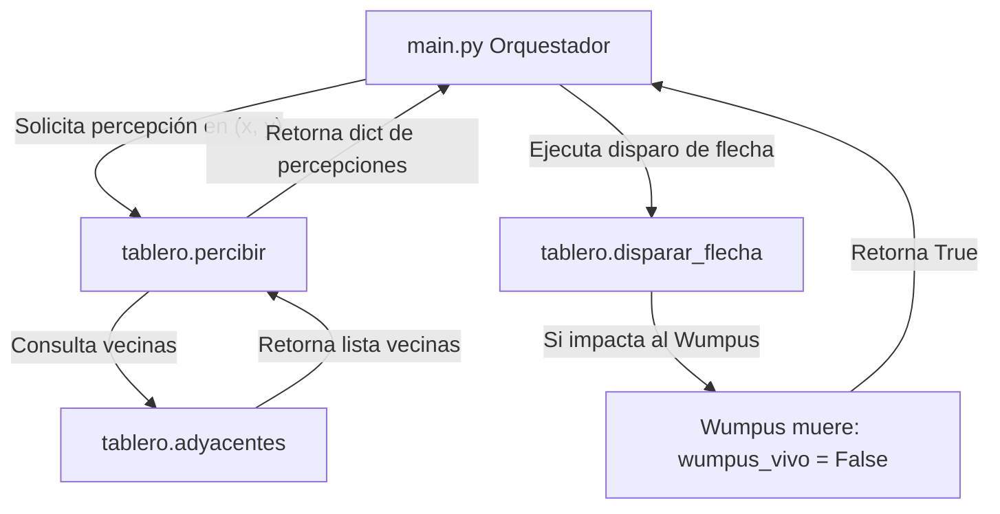

# Explicación Detallada de `tablero.py`

El módulo [`tablero.py`](tablero.py) representa el **Mundo Real (Single Source of Truth)** en la simulación del Mundo del Wumpus. Guarda el estado absoluto de los elementos del juego (Wumpus, pozos, oro) y expone únicamente las percepciones a las que el agente tiene derecho legal según su posición.

---

## 1. Rol dentro de la Arquitectura de Sistemas Expertos

En un Sistema Experto real existe una separación tajante entre el mundo físico (entorno) y el sistema de razonamiento. 

- **Aislamiento total (*Regla de Oro*):** El agente y el motor de inferencia **nunca** leen directamente la ubicación del Wumpus o los pozos desde este módulo. Solo interactúan mediante la función `percibir(tablero, x, y)`.
- **Representación de la verdad:** Almacena dónde están los elementos y actualiza los cambios físicos del mapa (por ejemplo, si el Wumpus muere tras recibir un flechazo).

---

## 2. Estructura de Datos del Tablero

La grilla se modela en un plano cartesiano de `4 × 4` donde:
- `x` (columnas): de 1 a 4 (de izquierda a derecha).
- `y` (filas): de 1 a 4 (de abajo hacia arriba).

El estado interno del tablero devuelto por `generar_tablero()` es un diccionario de Python:

```python
{
    'wumpus': (x_w, y_w),          # Tupla (x, y) con la posición del Wumpus
    'pozos': [(x1, y1), (x2, y2)], # Lista de tuplas con las posiciones de los pozos
    'oro': (x_o, y_o),             # Tupla (x, y) con la ubicación del oro
    'wumpus_vivo': True            # Booleano que indica el estado vital del Wumpus
}
```

---

## 3. Funcionamiento Detallado de las Funciones

### 3.1. `generar_tablero(cant_pozos=2)`

Genera una configuración de mapa válida y aleatoria.

- **Paso 1:** Construye la lista de las 15 casillas candidatas del tablero excluyendo explícitamente la casilla inicial `(1, 1)` mediante una lista por comprensión:
  ```python
  casillas_disponibles = [(x, y) for x in range(1, 5) for y in range(1, 5) if (x, y) != (1, 1)]
  ```
- **Paso 2:** Desordena al azar la lista con `random.shuffle()`.
- **Paso 3:** Extrae mediante `.pop()` los elementos sin riesgo de solapamiento:
  - 1 casilla para el Wumpus.
  - `cant_pozos` casillas (por defecto 2) para los Pozos.
  - 1 casilla para el Oro.
- **Retorno:** Retorna el diccionario con la verdad del mundo y `wumpus_vivo = True`.

---

### 3.2. `adyacentes(x, y)`

Calcula las casillas vecinas válidas ortogonales (arriba, abajo, izquierda, derecha) evitando salir del tablero.

- **Candidatos:** `[(x+1, y), (x-1, y), (x, y+1), (x, y-1)]`.
- **Filtro de bordes:** Mantiene únicamente las parejas `(a, b)` donde `1 <= a <= 4` y `1 <= b <= 4`.
- **Ejemplo:** Para `(1, 1)` retorna `[(2, 1), (1, 2)]`. Para `(2, 2)` retorna 4 adyacentes.

---

### 3.3. `percibir(tablero, x, y, hay_grito, hubo_golpe)`

Genera y retorna el diccionario de percepciones que el agente "siente" en su posición actual.

```python
{
    'breeze': bool,  # True si hay al menos un pozo en las casillas adyacentes.
    'stench': bool,  # True si el Wumpus está VIVO y en una casilla adyacente.
    'glitter': bool, # True si el agente está parado sobre la casilla del oro.
    'bump': bool,    # True si en el turno actual chocó contra un muro.
    'scream': bool   # True si en este turno el Wumpus murió por un flechazo.
}
```

#### Lógica interna de cada percepción:
- **`breeze` (Brisa):** Evalúa si `any(v in tablero['pozos'] for v in vecinas)`.
- **`stench` (Hedor):** Evalúa `wumpus_vivo and (tablero['wumpus'] in vecinas)`. Si el Wumpus ya murió, el hedor desaparece inmediatamente.
- **`glitter` (Brillo):** Simplemente verifica si `(x, y) == tablero['oro']`.
- **`bump` y `scream`:** Se integran pasando las banderas dinámicas informadas por el simular/orquestador.

---

### 3.4. `disparar_flecha(tablero, x, y, orientacion)`

Simula la trayectoria del proyectil cuando el agente dispara la flecha.

- **Vectores de dirección:** Utiliza el diccionario `DIRECCIONES` (`este`: `(+1,0)`, `norte`: `(0,+1)`, `oeste`: `(-1,0)`, `sur`: `(0,-1)`).
- **Recorrido en línea recta:** Un bucle `while` incrementa las coordenadas desde `(x + dx, y + dy)` hasta tocar el borde de la grilla 4×4.
- **Impacto:** Si alguna casilla recorrida coincide con `tablero['wumpus']` y este estaba vivo:
  - Cambia `tablero['wumpus_vivo'] = False`.
  - Retorna `True` (lo cual generará la percepción de `scream`).
- Si la flecha atraviesa todo el mapa sin golpear al Wumpus, retorna `False`.

---

## 4. Diagrama del Flujo de Interacción


